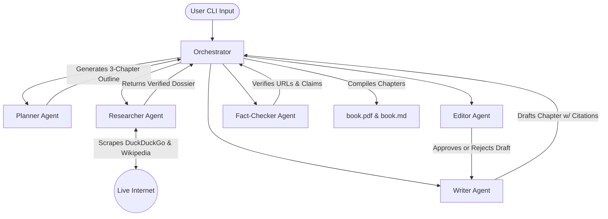

# 🤖 Multi-Agent AI Book Writer


An automated, multi-agent artificial intelligence pipeline that researches, writes, edits, and fact-checks entire books on any given topic. Using a Directed Acyclic Graph (DAG) architecture, specialized AI agents collaborate to scrape the live internet for verified facts and generate a beautifully formatted Markdown and PDF book.

---

## ✨ Features

- **Interactive Dynamic Prompts:** CLI asks for a custom Topic, Target Audience, and Tone, ensuring the book adapts to your exact specifications.
- **Live Internet Research:** Integrates `DuckDuckGo` and `Trafilatura` to scrape up to 15,000 characters from web pages and Wikipedia, ensuring the book is based on real facts, not just LLM memory.
- **Strict Fact-Checking:** An independent Fact-Checker agent cross-references the Writer's claims against the original URLs.
- **Automatic PDF Generation:** Converts the final markdown draft into a beautifully formatted, print-ready PDF using custom typography and CSS.
- **Resilient Rate-Limiting:** Built-in global 15-second delays and exponential backoff retry logic to seamlessly operate within the Google Gemini Free Tier quotas (15 requests/min).

---

## 🏗️ System Architecture

The application relies on a centralized **Orchestrator** that manages the state machine and passes data between 5 specialized agents.



### The Agents
1. **Planner:** Designs a structured outline with specific data points needed for research.
2. **Researcher:** Aggressively scrapes the web, extracts exact facts, and saves the URLs.
3. **Writer:** Writes the prose using ONLY the provided facts. Handles inline citations.
4. **Editor:** Enforces word count, tone, and formatting rules. Can reject drafts back to the Writer up to 3 times.
5. **Fact-Checker:** Re-downloads cited URLs to ensure the Writer didn't hallucinate facts.

---

## 🚀 Installation & Setup

1. **Clone the repository:**
```bash
git clone https://github.com/shinde0001/multi-agent-system-.git
cd multi-agent-system-
```

2. **Set up the virtual environment (Recommended):**
```bash
python3 -m venv venv
source venv/bin/activate
```

3. **Install dependencies:**
```bash
pip install -r requirements.txt
```

4. **Add your API Key:**
Create a `.env` file in the root directory and add your Google Gemini API key:
```ini
GEMINI_API_KEY="your_api_key_here"
```

---

Run the orchestrator from the project root:

```bash
# If you just cloned the repo:
cd multi-agent-system-

# Run the pipeline:
python3 main.py
```

### 💡 Interactive CLI Example

When you run `main.py`, you will be prompted for inputs. Here is an example of what to type for optimal results:

```text
Welcome to the Multi-Agent Book Writer!
Do you want to write the default 'UPI' book? (y/n) [y/n] (y): n
What is the title/topic of your book?: Quantum Computing Applications in Modern Cryptography
Who is the target audience? (General readers): Computer Science Researchers & Cybersecurity Engineers
What tone should the book have? (Professional and engaging): Technical, academic, and rigorous
```

### Step-by-Step Workflow:
1. **Choose Topic Mode:** Select `y` to generate the default UPI payments research book, or `n` to enter custom parameters.
2. **Provide Details:** Enter your desired **Topic**, **Target Audience**, and **Tone** when prompted.
3. **Watch the Agents:** The system will autonomously plan chapters, scrape search engines & Wikipedia for facts, write text with citations, run editorial quality checks, and fact-check references.
4. **Access Generated Book:** Once completed, your full book is exported to `output/book.md` and styled `output/book.pdf`.

---

## 🛠️ Built With
- **[Google GenAI SDK](https://ai.google.dev/)** - LLM engine (`gemini-3.5-flash-lite`)
- **[Pydantic](https://docs.pydantic.dev/)** - Enforces strict JSON structures between agents
- **[DuckDuckGo Search](https://pypi.org/project/duckduckgo-search/)** - Live web search
- **[Trafilatura](https://trafilatura.readthedocs.io/)** - High-speed web scraping
- **[md2pdf](https://github.com/jmaupetit/md2pdf)** - Automated PDF rendering
- **[Rich](https://github.com/Textualize/rich)** - Beautiful terminal UI
